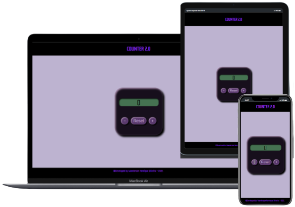

<h1>Contador 2.0</h1>

<h2>Sobre:</h2>

Este projeto tem como objetivo recriar um contador utilizando o hook <strong>useState</strong>. 

[https://purplecounter.herokuapp.com](https://purplecounter.herokuapp.com)

 

<h2>  Ferramentas:</h2>

 
<h2>  Como funciona?</h2>

</h2>

- Ao clilcar em <button>+</button> será adicionado mais 1 número.

- Ao clilcar em <button>-</button> será reduzido mais 1 número.

- Ao clilcar em <button>Reset</button> a contagem  volta para o úmero oiginal.

 
<h2>Preview:</h2>

